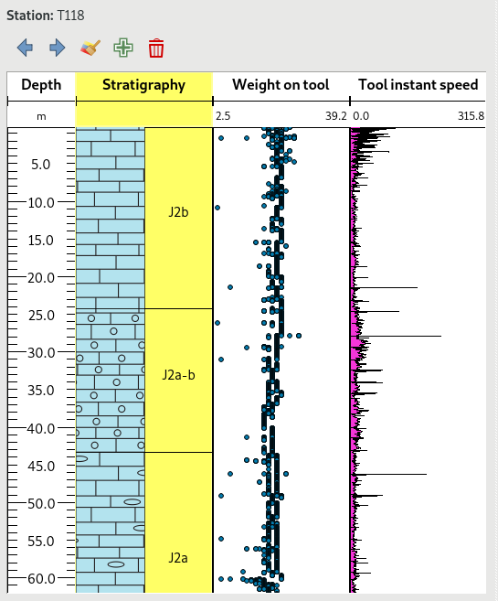

# QGIS Well log widget

This project allows to visualize logs of drilling wells or boreholes.

**Warning** This is still experimental.

It is based on QT and the QGIS rendering engine to plot series of measurements. This allows to:
- use the rich symbology engine of QGIS to display underground data
- have decent display performances, since QGIS is optimized to quickly render geometries possibly made by lots of points

Currently three types of data are handled:
- stratigraphy data, where a polygon is defined by a depth range and a pattern fill is given by a rock code
- continuous series of data that represent data sampled continuously underground (a sample every centimer for instance). This could also be reused to plot time series.
- scatter plots of data



# How to use it

First you can add qgs_well_log as a dependency of your project with a git submodule. Type this inside your main python module

```shell
git submodule add ssh://git@git.oslandia.net:10022/Oslandia-3d/qgis_well_log.git
```

Then you have to add this module in Python path by editing your main *__init__.py* file

```python
import os
import sys

# append sub modules
sys.path.append(os.path.join(os.path.dirname(__file__),
                             "qgis_well_log"))

```

Finally you have to choose your interface *LayerData* or *FeatureData*, create a WellLogView object and add it to your application. See [main entry point](well_log/well_log_view.py) for examples.


