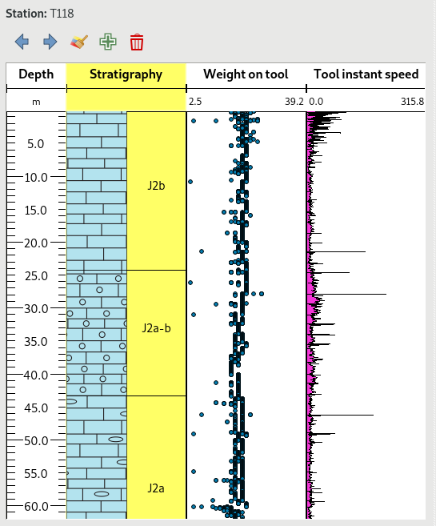

# QGeoloGIS plugin

This project allows to visualize logs of drilling wells or boreholes and time series.

**Warning** This is still experimental.

It is based on QT and the QGIS rendering engine to plot series of measurements. This allows to:
- use the rich symbology engine of QGIS to display underground data
- have decent display performances, since QGIS is optimized to quickly render geometries possibly made by lots of points

Currently three types of data are handled:
- stratigraphy data, where a polygon is defined by a depth range and a pattern fill is given by a rock code
- continuous series of data that represent data sampled continuously underground (a sample every centimer for instance). This could also be reused to plot time series.
- scatter plots of data



See the [corresponding video](https://vimeo.com/303279452)

# How to use it as a standalone plugin

Install the plugin in the QGIS plugin directory and enable it.

It requires a configuration that describes what is the base layer that displays measure points and how to access the different measure layers.

You can find an [example configuration file](layer_config.py.sample) that you should copy to `layer_config.py` and edit to adapt to your environment.
Once configured, copy it where the QGIS plugin is installed.

The configuration file can also be changed once the plugin is launched, through the "Load configuration file" menu entry in the "Extension" menu of QGIS.

# How to use it in your own plugin

First you can add QGeoloGIS as a dependency of your project with a git submodule. Type this inside your main python module

```shell
git submodule add https://github.com/Oslandia/QGeoloGIS.git
```

Then you have to add this module in Python path by editing your main *__init__.py* file

```python
import os
import sys

# append sub modules
sys.path.append(os.path.join(os.path.dirname(__file__),
                             "qgeologis"))

```

Finally you have to choose your interface *LayerData* or *FeatureData*, create a WellLogView object and add it to your application. See [main entry point](qgeologis/log_view.py) for examples.


